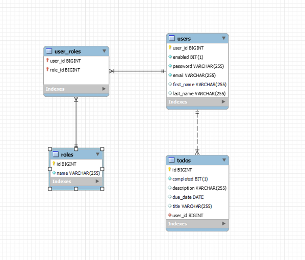

# Todo List Application

This is a fullstack Todo List application built using Spring Boot, Spring Security Jwt, AngularTS, and MySQL. It allows users to manage their tasks efficiently.

## Table of Contents

- [Features](#features)
- [Technologies Used](#technologies-used)
- [Architecture Diagram](#architecture-diagram)
- [Setup](#setup)
  - [Prerequisites](#prerequisites)
  - [Installation](#installation)
- [Usage](#usage)
- [License](#license)

## Features

- User authentication and authorization using Spring Security JWT token.
- CRUD operations for managing tasks.
- Send emails via thymeleaf template engine .
- Categorize completed and unfinished user tasks
- User-friendly interface built with Angular single page application.
- Data persistence using MySQL database.

## Technologies Used

- **Technology used** : Spring Boot 3, Spring Security 6 , Angular 17 , MySQL.
- **Deployment** : Deploy Frontend in https://vercel.com/ and Backend with https://railway.app/

## Architecture Diagram



## Setup

### Prerequisites

Before running this application, ensure you have the following installed:

- Java Development Kit (JDK)
- Node.js version > 16 and npm
- MySQL Server

### Installation

1. Clone this repository:
   ```bash
   git clone https://github.com/Vanhuyne/todo-list.git
   ```
2. Navigate to the backend directory:
   ```bash
   cd todo-backend
   ```
3. Run the Spring Boot application:
   ```bash
   ./mvnw spring-boot:run
   ```
4. Open another terminal and navigate to the frontend directory:
   ```bash
   cd ../todo-frontend
   ```
5. Install Angular dependencies:
   ```bash
   npm install
   ```
6. Start the Angular development server:
   ```bash
   ng serve
   ```

## Usage

1. Open your web browser and go to http://localhost:4200.
2. Register a new account or log in with existing credentials.
3. Add, edit, or delete tasks as needed.

## License

This README.md content now includes the Installation section, providing instructions for setting up the project. You can save this content in a file named `README.md` in the root directory of your Git repository.
